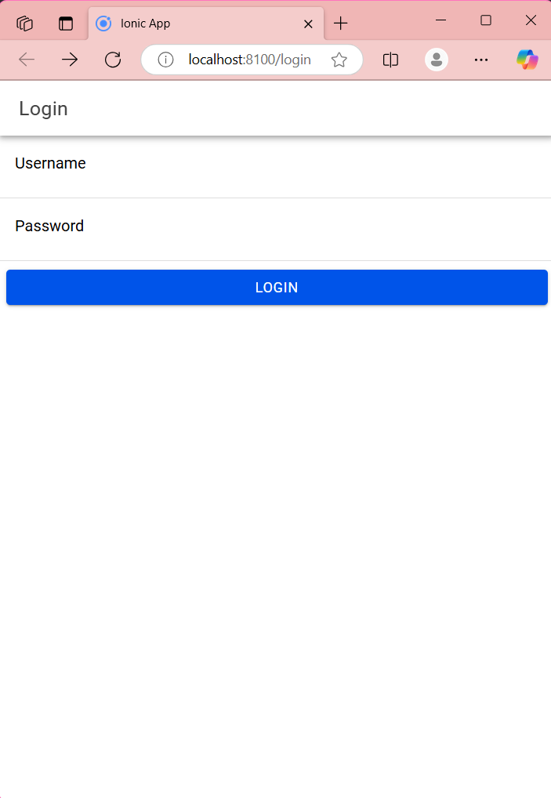
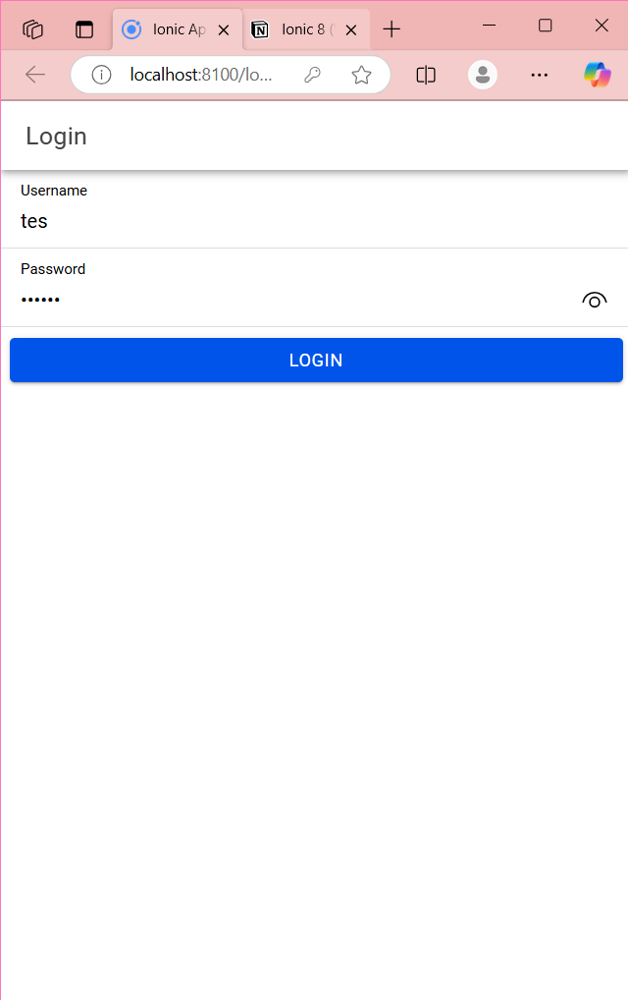

# Cara Kerja Login :

API Endpoint (PHP):
1. Server-side script login.php memproses permintaan login. Pertama, ia mengambil input JSON yang dikirim dari aplikasi Ionic (data username dan password).
2. username dan password diekstrak dari data input, di mana password dienkripsi menggunakan md5.
3. Server mengecek kecocokan data login dengan database. Jika cocok, ia mengembalikan respons JSON berisi username, token, dan status berhasil. Jika tidak cocok, status gagal dikembalikan.

*Aplikasi Ionic (Client-Side):*
1. Pada halaman login (LoginPage), terdapat dua ion-input untuk menerima username dan password dari pengguna.
2. Saat tombol login diklik, fungsi login() dijalankan. Fungsi ini:
- Memastikan bahwa username dan password tidak kosong. Jika kosong, pesan peringatan ditampilkan.
- Jika data terisi, aplikasi mengirimkan permintaan HTTP POST ke server dengan data username dan password.
- Menggunakan AuthenticationService untuk memanggil metode postMethod(), yang mengirim data ke endpoint login.php.
- 
*AuthenticationService (Client-Side Service):*
1. postMethod() mengirim permintaan POST ke server.
2. Setelah respons diterima, aplikasi mengecek status_login. Jika status_login adalah "berhasil":
- saveData() disimpan ke Preferences (local storage) untuk menyimpan token dan username, memastikan pengguna tetap login.
- Pengguna dialihkan ke halaman Home.
3. Jika status_login adalah "gagal" atau ada kesalahan koneksi, notifikasi kesalahan ditampilkan.

*Guard dan Routing:*
1. Guard authGuard memeriksa apakah pengguna sudah login sebelum mengakses halaman Home.
2. Guard autoLoginGuard mengecek jika pengguna sudah login; jika iya, mereka langsung diarahkan ke Home tanpa harus login ulang.
3. Ini memastikan bahwa pengguna yang sudah login tidak perlu masuk lagi selama sesi masih aktif.

*Home Page:*
1. Di HomePage, nama pengguna ditampilkan. Pengguna dapat logout dengan mengklik tombol logout yang akan memanggil logout() di AuthenticationService.
2. logout() menghapus data login dan mengarahkan pengguna kembali ke halaman Login.

# Screenshot Hasil

Halaman Sebelum login

Halaman ketika input username & password

halaman ketika sukses login

Halaman ketika logout

